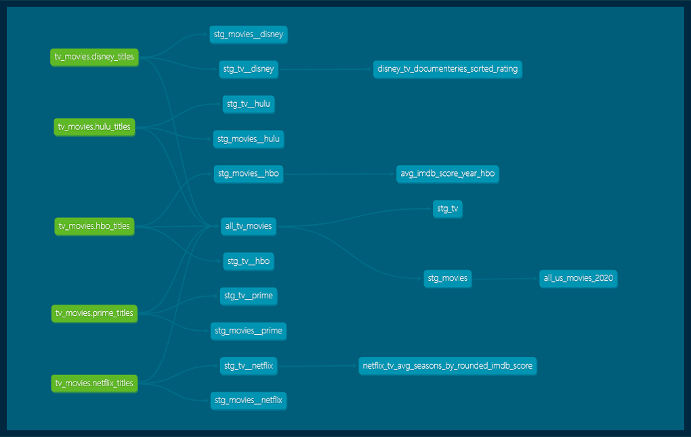

# DBT Streaming Services: TV and Movies


## Contributors:

- [Dylan Peterson](https://github.com/DyPeterson)

##  Description:

A independent project to demonstrate what I've learned with a week-long exploration of [DBT](https://www.getdbt.com/).

###  Technologies Used:

- [Visual Code Studio](https://code.visualstudio.com/)

- [Windows Terminal](https://apps.microsoft.com/store/detail/windows-terminal/9N0DX20HK701?hl=en-us&gl=US) ( Running: [WSL2](https://docs.microsoft.com/en-us/windows/wsl/install) ([ubuntu 20.04](https://releases.ubuntu.com/20.04/)))

###  Programs used:

- [DBT(CLI and online IDE)](https://www.getdbt.com/)

- [Google BigQuery](https://cloud.google.com/bigquery)

### Dataset:

Combination of all 5 of these CSVs:

[Hulu](https://www.kaggle.com/datasets/victorsoeiro/hulu-tv-shows-and-movies)

[HBO Max](https://www.kaggle.com/datasets/victorsoeiro/hbo-max-tv-shows-and-movies)

[Amazon Prime](https://www.kaggle.com/datasets/victorsoeiro/amazon-prime-tv-shows-and-movies)

[Disney+](https://www.kaggle.com/datasets/victorsoeiro/disney-tv-shows-and-movies)

[Netflix](https://www.kaggle.com/datasets/victorsoeiro/netflix-tv-shows-and-movies)

##  Setup & Installation:

### Installation:

1. Through the terminal like [GitBash](https://git-scm.com/downloads)

	2. Open the terminal and navigate to where you would like the new project to be using `cd` commands. Its also recommended that you make a new directory using `mkdir *directory-name*`.

	3. Clone the repository using the command `git clone https://github.com/DyPeterson/dbt-tv-movies.git`

	4. After cloning the directory it will appear in the directory that your terminal is set to. So make sure you are in the directory that you want this project copied to.

	5. Once this project is cloned you can navigate to that folder within your terminal and create a virtual environment `python3.7 -m venv *any-name*`. Now activate the venv with `source *any-name*/bin/activate`

	6. Install requirements in venv `pip install -r requirements.txt`

2. Through GitHub.com

	3. Go to the project's directory page **[HERE](https://github.com/DyPeterson/monkeypox.git)**

	4. Click the green `code` button to open the drop-down menu.

	5. At the bottom of the menu will have *Download Zip*. Go ahead and click it to download the project.

	6. Once downloaded find the `.zip` file and right-click it to bring up the menu. Within that menu click `Extract Here` to extract it in the current folder or click `Extract Files...`to select which folder you would like the project in.

### Set-up:

Follow along for the bigquery set-up on [DBT Docs](https://docs.getdbt.com/guides/getting-started/getting-set-up/setting-up-bigquery)

The dataset is currently live to the public for viewing on BigQuery
Configurations:

 - Project ID: `dpeterson`
 
 - Dataset ID: `tv_movies`

 - Full address: `dpeterson.tv_movies`

##  Details:

This project uses DBT to create models based on 5 streaming services catalog of movies & TV shows. DBT use SQL statements to create models based of a dataset hosted in a warehouse, I used BigQuery for this project. I tried to create a model that would be similar to something you may see in a production environment. 

### DBT DAG:



### File Tree:
```
tv-movies
├─ .gitignore
├─ README.md
├─ analyses
│  └─ .gitkeep
├─ dbt_project.yml
├─ img
│  ├─ dbt-dag.png
│  └─ title.png
├─ macros
│  └─ .gitkeep
├─ models
│  ├─ marts
│  │  └─ core
│  │     ├─ all_us_movies_2020.sql
│  │     ├─ avg_imdb_score_year_hbo.sql
│  │     ├─ disney_tv_documenteries_sorted_rating.sql
│  │     └─ netflix_tv_avg_seasons_by_rounded_imdb_score.sql
│  └─ staging
│     └─ streaming_tv_movies
│        ├─ _streaming__docs.md
│        ├─ _streaming__models.yml
│        ├─ _streaming__sources.yml
│        ├─ all_tv_movies.sql
│        ├─ movies
│        │  ├─ stg_movies.sql
│        │  ├─ stg_movies__disney.sql
│        │  ├─ stg_movies__hbo.sql
│        │  ├─ stg_movies__hulu.sql
│        │  ├─ stg_movies__netflix.sql
│        │  └─ stg_movies__prime.sql
│        └─ tv
│           ├─ stg_tv.sql
│           ├─ stg_tv__disney.sql
│           ├─ stg_tv__hbo.sql
│           ├─ stg_tv__hulu.sql
│           ├─ stg_tv__netflix.sql
│           └─ stg_tv__prime.sql
├─ requirements.txt
├─ seeds
│  ├─ .gitkeep
│  ├─ disney-titles.csv
│  ├─ hbo-titles.csv
│  ├─ hulu-titles.csv
│  ├─ netflix-titles.csv
│  ├─ prime-titles.csv
│  └─ properties.yml
├─ snapshots
│  └─ .gitkeep
└─ tests
   └─ .gitkeep

```

##  Useful Links:

###  Link to project on GitHub:

[GitHub](https://github.com/DyPeterson/monkeypox)

### Dataset:

Combination of all 5 of these CSVs:

[Hulu](https://www.kaggle.com/datasets/victorsoeiro/hulu-tv-shows-and-movies)

[HBO Max](https://www.kaggle.com/datasets/victorsoeiro/hbo-max-tv-shows-and-movies)

[Amazon Prime](https://www.kaggle.com/datasets/victorsoeiro/amazon-prime-tv-shows-and-movies)

[Disney+](https://www.kaggle.com/datasets/victorsoeiro/disney-tv-shows-and-movies)

[Netflix](https://www.kaggle.com/datasets/victorsoeiro/netflix-tv-shows-and-movies)

[All 5 CSVs Cleaned](https://github.com/DyPeterson/streaming_datasets)


##  Known Bugs:

No known bugs at this time.

## Future Features:

- Add a column to each data set signifying with streaming service(s) they are hosted on and use that to create one large dataset.

- Expand the project with many custom tests

- Expand the models to more mimic a production environment

###  Copyright 2022

Permission is hereby granted, free of charge, to any person obtaining a copy of this software and associated documentation files (the "Software"), to deal in the Software without restriction, including without limitation the rights to use, copy, modify, merge, publish, distribute, sublicense, and/or sell copies of the Software, and to permit persons to whom the Software is furnished to do so, subject to the following conditions:

The above copyright notice and this permission notice shall be included in all copies or substantial portions of the Software.

THE SOFTWARE IS PROVIDED "AS IS", WITHOUT WARRANTY OF ANY KIND, EXPRESS OR IMPLIED, INCLUDING BUT NOT LIMITED TO THE WARRANTIES OF MERCHANTABILITY, FITNESS FOR A PARTICULAR PURPOSE AND NONINFRINGEMENT. IN NO EVENT SHALL THE AUTHORS OR COPYRIGHT HOLDERS BE LIABLE FOR ANY CLAIM, DAMAGES OR OTHER LIABILITY, WHETHER IN AN ACTION OF CONTRACT, TORT OR OTHERWISE, ARISING FROM, OUT OF OR IN CONNECTION WITH THE SOFTWARE OR THE USE OR OTHER DEALINGS IN THE SOFTWARE.